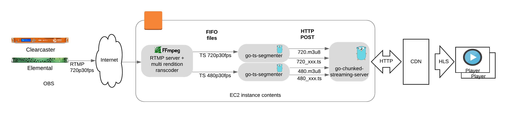
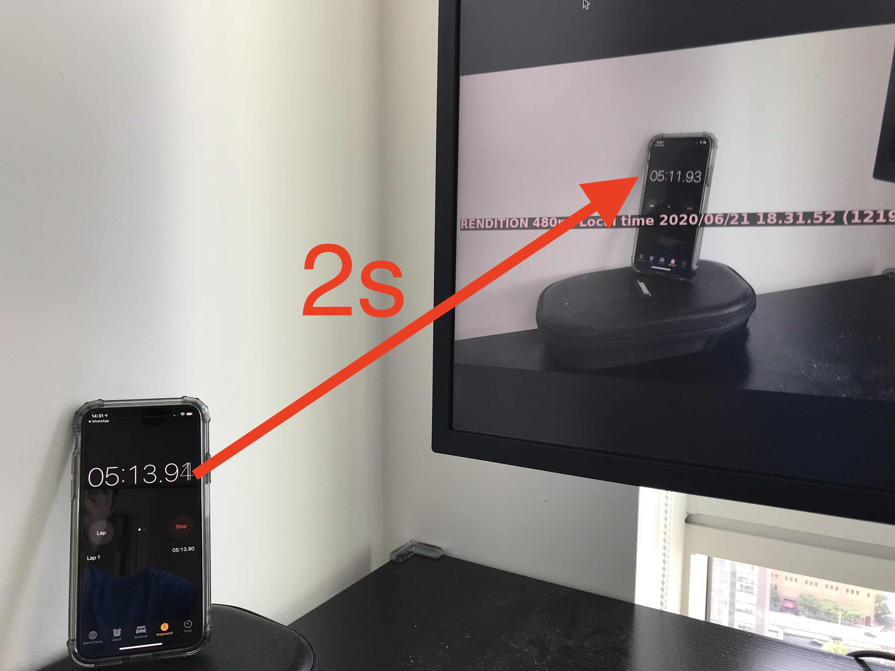

# lhls-simple-live-platform
This readme shows how to build a very simple live streaming platform based on open source tools with a glass to glass latency around 2s.

To learn more about it see the presentation at syd\<video\> on 2020/06/24:
- Slides (TODO)
- Video (TODO)

## Block diagram


## Installation
- Launch EC2
    - Type: 
        - t2.small (for transmuxing)
        - t2.xlarge (for transcoding from 720p to 720p and 480p)
    - Security groups
        - Open Inbound 1935 for everybody
        - Open Inbound 9094 for everybody
- Install git: `sudo yum install git -y`
- (optional) Install tmux: `sudo yum install tmux -y`
- Install (compile) ffmpeg
    - You can use this [script](https://github.com/jordicenzano/ffmpeg-compile-centos-amazon-linux) or [source code](https://trac.ffmpeg.org/wiki/CompilationGuide)
- Install DejaVu fonts (to do the overlay on transcoding): `sudo yum install dejavu-sans-fonts -y`
- Install GO, see [instructions](https://golang.org/doc/install)
- From your home dir `cd ~` install and compile [go-ts-segmenter](https://github.com/jordicenzano/go-ts-segmenter)
```
go get github.com/jordicenzano/go-ts-segmenter
cd ~/go/src/github.com/jordicenzano/go-ts-segmenter
go get
make
```
- From your home dir `cd ~` install and compile [go-chunked-streaming-server](https://github.com/mjneil/go-chunked-streaming-server)
```
go get github.com/mjneil/go-chunked-streaming-server
cd ~/go/src/github.com/mjneil/go-chunked-streaming-server
make
```

## Usage
- Create a shell to the EC2 machine (`tmux` recommended), and start webserver in HTTPS
```
cd ~/go/src/github.com/mjneil/go-chunked-streaming-server
./bin/go-chunked-streaming-server
```
- Create ANOTHER shell to the EC2 machine (`tmux` recommended), start RTMP server + segmenter with a multirendion transcoding configuration
```
cd ~/go/src/github.com/mjneil/go-chunked-streaming-server/scripts
./transcoding-multirendition-rtmp.sh live
```
- Open your favorite RTMP client: [OBS](https://obsproject.com/), [Wirecast](https://www.telestream.net/wirecast/overview.htm), [Elemental](https://aws.amazon.com/elemental-live/), [Wowza Clearcaster](https://www.wowza.com/products/clearcaster),  [ffmpeg](https://ffmpeg.org/), etc
    - Configure the RTMP URL as: `rtmp://[PUBLIC-IP-EC2]:1935/live/stream`
    - Recommended short GOP (1s) and (if possible) activate "zerolatency" video encoding mode
    - Start streaming
- Open your favorite HLS player: [Safari](https://www.apple.com/safari/), [Quicktime](https://support.apple.com/en-us/HT201066), [VideoJS](https://videojs.com/), [ffplay](https://ffmpeg.org/ffplay.html), etc
    - Use this URL: `http://[PUBLIC-IP-EC2]:9094/mrrtmp/playlist.m3u8`
        
- Example glass to glass latency with this set up: **2.01s**



## Notes
- This is JUST A PROOF OF CONCEPT / PROTOTYPE do not use it in production
    - Example of known problem: If the encoder reconnect for any reason, the live stream finishes
- There is a lot going on about how to do ABR when you are sending data at "media speed" and NOT at "cable speed". So for multirendtion and chunk transfer you should expect regular players going to the lower BW lane
- [go-chunked-streaming-server](https://github.com/mjneil/go-chunked-streaming-server) does not send `max-age` headers, so if you want to add a CDN on top of this prototype you need tp set up the expiration manually